# MySQL Database ER Diagram for Miss182 E-commerce Project

```mermaid
erDiagram
    users ||--o{ addresses : has
    users ||--o{ orders : places
    users ||--o{ cart : has
    users ||--o{ wishlist : has
    users ||--o{ reviews : writes
    
    addresses }o--|| orders : used_for_shipping
    addresses }o--|| orders : used_for_billing
    
    product_table_ecom ||--o{ order_items : included_in
    product_table_ecom ||--o{ cart_items : added_to
    product_table_ecom ||--o{ wishlist : saved_in
    product_table_ecom ||--o{ reviews : receives
    
    orders ||--o{ order_items : contains
    cart ||--o{ cart_items : contains
    
    ecom_category_master ||--o{ product_table_ecom : categorizes
    ecom_category_master ||--o{ ecom_sub_category_master : has
    ecom_sub_category_master ||--o{ ecom_super_sub_category_master : has
    ecom_sub_category_master ||--o{ product_table_ecom : sub_categorizes
    ecom_super_sub_category_master ||--o{ product_table_ecom : super_sub_categorizes
    ecom_brand_master ||--o{ product_table_ecom : brands
    ecom_uom_master_table ||--o{ product_table_ecom : measures
    
    product_table_ecom }|--|| product_table : related_to

    users {
        int id PK
        varchar email
        varchar password
        varchar name
        varchar phone
        enum role
        timestamp created_at
        timestamp updated_at
    }
    
    addresses {
        int id PK
        int user_id FK
        varchar full_name
        varchar address_line_1
        varchar address_line_2
        varchar city
        varchar state
        varchar postal_code
        varchar country
        varchar phone
        boolean is_default
        timestamp created_at
        timestamp updated_at
    }
    
    orders {
        int id PK
        int user_id FK
        int shipping_address_id FK
        int billing_address_id FK
        varchar payment_method
        enum status
        decimal subtotal
        decimal shipping_cost
        decimal tax
        decimal discount
        decimal total_amount
        timestamp created_at
        timestamp updated_at
    }
    
    order_items {
        int id PK
        int order_id FK
        int product_id FK
        int quantity
        decimal price
        decimal total
        timestamp created_at
    }
    
    cart {
        int id PK
        int user_id FK
        timestamp created_at
        timestamp updated_at
    }
    
    cart_items {
        int id PK
        int cart_id FK
        int product_id FK
        int quantity
        timestamp created_at
        timestamp updated_at
    }
    
    wishlist {
        int id PK
        int user_id FK
        int product_id FK
        timestamp created_at
    }
    
    reviews {
        int id PK
        int user_id FK
        int product_id FK
        int rating
        varchar title
        text content
        timestamp created_at
        timestamp updated_at
    }
    
    product_table_ecom {
        int tid PK
        varchar sku
        varchar product_type
        varchar category
        varchar sub_category
        varchar super_sub_category
        varchar brand_name
        varchar product_name
        int stock
        varchar unit
        varchar tax_type
        decimal selling_price
        decimal purchase_price
        decimal mrp
        varchar supplier_name
        varchar colour
        varchar size
        varchar barcode
        int pack_stock
        text product_description
        varchar rack_details
        varchar image1_url
        int min_stock
        varchar part_no_01
        varchar part_no_02
        varchar part_no_03
        int stock_on_hold
        decimal discount_percentage
        varchar offer_name
        decimal whole_sale_price
        int opening_stock
        varchar ext_file_1
        varchar ext_file_2
        varchar ext_file_3
        varchar ext_file_4
        varchar ext_file_5
        varchar ext_file_6
        text description_1
        text description_2
        text faq
        decimal sub_save_1
        decimal sub_save_2
        decimal sub_save_3
        text meta_tag
        decimal weight
        varchar product_card
        varchar flow
        varchar ext_file_hover
        varchar product_display_name
        varchar ext_file_banner_1
        varchar ext_file_banner_2
        varchar ext_file_banner_3
        varchar ext_file_banner_4
        varchar ext_file_banner_5
        varchar ext_file_7
        varchar ext_file_8
        varchar ext_file_9
        varchar ext_file_10
    }
    
    product_table {
        int tid PK
        varchar sku
        varchar size
        varchar colour
    }
    
    ecom_category_master {
        int tid PK
        varchar category
        text describition
        varchar ext_file
        date created_on
        varchar created_by
        date last_updated_on
    }
    
    ecom_sub_category_master {
        int tid PK
        varchar sub_category
        varchar category
        text describition
        varchar ext_file
        date created_on
        varchar created_by
        date last_updated_on
    }
    
    ecom_super_sub_category_master {
        int tid PK
        varchar super_sub_category
        varchar sub_category
        varchar category
        text describition
        varchar ext_file
        date created_on
        varchar created_by
        date last_updated_on
    }
    
    ecom_brand_master {
        int tid PK
        varchar brand_name
        text describition
    }
    
    ecom_uom_master_table {
        int tid PK
        varchar uom
    }
    
    customer_table {
        int tid PK
        varchar fname
        varchar lname
        varchar street
        varchar door_no
        varchar city
        varchar state
        varchar pin_code
        varchar country
        varchar email
        varchar password
        varchar phone_number
        varchar ext_file
        int reward_points
    }
```

## Database Schema Description

This ER diagram represents the database schema for an e-commerce application with the following main entities:

### Core E-commerce Tables
- **users**: Stores user account information
- **addresses**: Stores shipping and billing addresses for users
- **orders**: Tracks customer orders
- **order_items**: Individual products in each order
- **cart**: Shopping cart for each user
- **cart_items**: Products in each user's cart
- **wishlist**: Products saved to users' wishlists
- **reviews**: Product reviews by users

### Product-Related Tables
- **product_table_ecom**: Main product table with comprehensive details
- **product_table**: Additional product information (appears to be a legacy or supplementary table)

### Categorization Tables
- **ecom_category_master**: Top-level product categories
- **ecom_sub_category_master**: Second-level product categories
- **ecom_super_sub_category_master**: Third-level product categories
- **ecom_brand_master**: Product brands
- **ecom_uom_master_table**: Units of measurement

### Legacy Customer Table
- **customer_table**: Appears to be a legacy customer table with the new schema migrating customers to the users table

### Key Relationships
- Users can have multiple addresses, orders, carts, wishlists, and reviews
- Orders have shipping and billing addresses
- Orders contain multiple order items
- Products belong to categories, subcategories, and brands
- Products can be in multiple carts, wishlists, and orders 