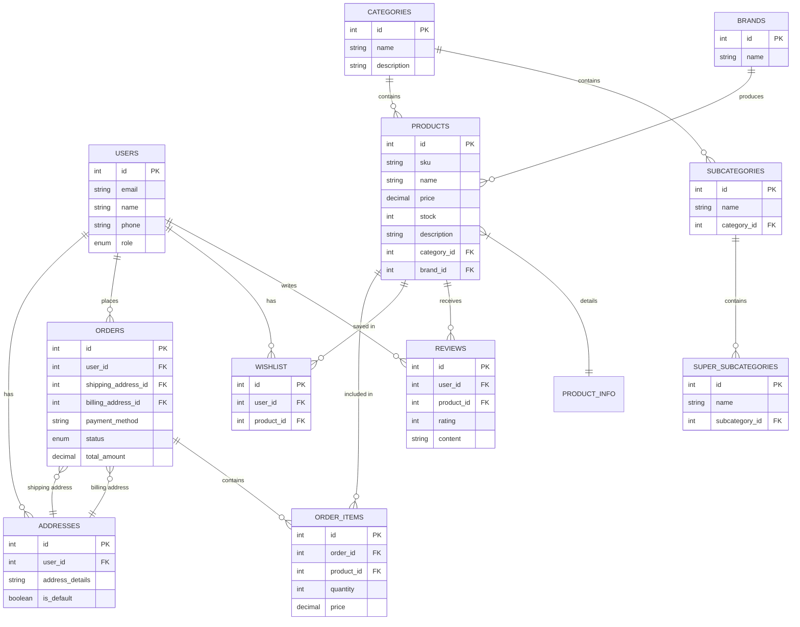

# Simplified MySQL Database ER Diagram

## Key Database Components

This simplified ER diagram focuses on the core tables and relationships in the e-commerce database:

1. **User Management**
   - Users with their personal information
   - Address management for shipping and billing

2. **Product Catalog**
   - Products with detailed information
   - Hierarchical categorization (Categories → Subcategories → Super-subcategories)
   - Brand management

3. **Order Processing**
   - Orders with shipping and billing information
   - Order items with product details

4. **User Engagement**
   - Wishlist functionality
   - Product reviews and ratings

This database design supports a feature-rich e-commerce platform with comprehensive product management, user accounts, order processing, and customer engagement features. 